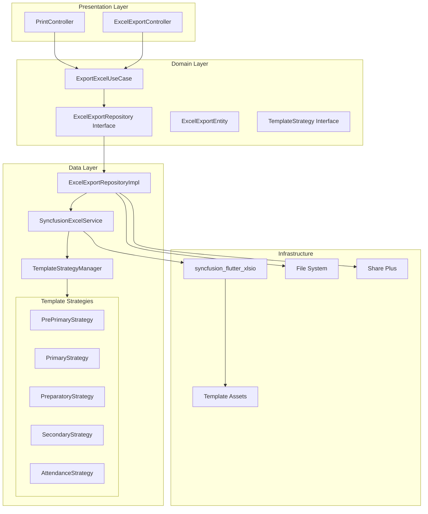

# Excel Export Architecture Plan for Moalem App

## Executive Summary

This document provides a comprehensive architecture plan for implementing Excel report export functionality in the Moalem Flutter application using `syncfusion_flutter_xlsio`. The solution follows Clean Architecture principles with clear separation between Domain, Data, and Presentation layers.

---

## Current State Analysis

### Existing Implementation
The app currently uses the `excel` package (v0.any) with a template-based approach:

**File:** [`lib/features/print/data/services/excel_export_service.dart`](lib/features/print/data/services/excel_export_service.dart:1)

**Key Components:**
1. [`ExcelExportService`](lib/features/print/data/services/excel_export_service.dart:15) - Main service class
2. [`ExcelTemplateConfig`](lib/features/print/data/services/excel_export_service.dart:88) - Abstract configuration base
3. Stage-specific configs: [`PrePrimaryConfig`](lib/features/print/data/services/excel_export_service.dart:181), [`Primary36Config`](lib/features/print/data/services/excel_export_service.dart:688), [`PreparatoryConfig`](lib/features/print/data/services/excel_export_service.dart:1160), [`SecondaryMonthlyConfig`](lib/features/print/data/services/excel_export_service.dart:1400), [`AttendanceConfig`](lib/features/print/data/services/excel_export_service.dart:1710)

### Identified Limitations of Current Implementation
1. Uses `excel` package which has limited formatting preservation
2. No support for merged cells preservation
3. Complex cell styling requires manual recreation
4. Formula support is limited

---

## Proposed Architecture Overview



---

## 1. Domain Layer

### 1.1 Entities

#### ExcelExportEntity
**File:** `lib/features/excel_export/domain/entities/excel_export_entity.dart`

```dart
/// Entity representing Excel export request data
class ExcelExportEntity {
  final String id;
  final ExportType exportType;
  final EducationalStage stage;
  final SchoolInfo schoolInfo;
  final ClassInfo classInfo;
  final List<StudentExportData> students;
  final ExportOptions options;
  final DateTime createdAt;

  const ExcelExportEntity({
    required this.id,
    required this.exportType,
    required this.stage,
    required this.schoolInfo,
    required this.classInfo,
    required this.students,
    required this.options,
    required this.createdAt,
  });
}

/// School information for headers
class SchoolInfo {
  final String governorate;      // مديرية التربية والتعليم
  final String administration;   // الإدارة
  final String schoolName;       // المدرسة

  const SchoolInfo({
    required this.governorate,
    required this.administration,
    required this.schoolName,
  });
}

/// Class information
class ClassInfo {
  final String className;        // اسم الفصل
  final String grade;            // الصف
  final String subject;          // المادة
  final String? section;         // الفصل الدراسي (للثانوي)

  const ClassInfo({
    required this.className,
    required this.grade,
    required this.subject,
    this.section,
  });
}

/// Student data for export
class StudentExportData {
  final String studentId;
  final String name;
  final int number;
  final Map<int, Map<String, int>> weeklyScores;  // week -> evalId -> score
  final Map<int, int> weeklyTotals;
  final Map<String, int>? monthlyExamScores;
  final Map<int, Map<DateTime, AttendanceStatus>>? weeklyAttendance;

  const StudentExportData({
    required this.studentId,
    required this.name,
    required this.number,
    required this.weeklyScores,
    required this.weeklyTotals,
    this.monthlyExamScores,
    this.weeklyAttendance,
  });

  int getScoreForWeek(int week, String evaluationId) {
    return weeklyScores[week]?[evaluationId] ?? 0;
  }

  int getTotalForWeek(int week) {
    return weeklyTotals[week] ?? 0;
  }
}

enum ExportType { scores, attendance, yearlyWork }

enum EducationalStage {
  prePrimary,    // أولى وتانية ابتدائي
  primary,       // 3-6 ابتدائي
  preparatory,   // إعدادي
  secondary,     // ثانوي نظام شهور
}

class ExportOptions {
  final int weekGroup;           // 1-4 for different week ranges
  final bool includeSemesterAverage;
  final bool includeMonthlyExams;
  final DateTime? exportDate;

  const ExportOptions({
    this.weekGroup = 1,
    this.includeSemesterAverage = true,
    this.includeMonthlyExams = true,
    this.exportDate,
  });
}
```

### 1.2 Repository Interface

**File:** `lib/features/excel_export/domain/repositories/excel_export_repository.dart`

```dart
abstract class ExcelExportRepository {
  /// Export student scores to Excel using template-based approach
  /// Returns the file path of the exported file
  Future<String> exportScores({
    required ExcelExportEntity exportData,
  });

  /// Export attendance records to Excel
  Future<String> exportAttendance({
    required ExcelExportEntity exportData,
  });

  /// Export yearly work report (أعمال السنة)
  Future<String> exportYearlyWork({
    required ExcelExportEntity exportData,
  });

  /// Get available templates for a stage
  List<TemplateInfo> getAvailableTemplates(EducationalStage stage);

  /// Preview export data (for validation)
  Future<ExportPreview> previewExport({
    required ExcelExportEntity exportData,
  });
}

class TemplateInfo {
  final String name;
  final String assetPath;
  final EducationalStage stage;
  final ExportType type;

  const TemplateInfo({
    required this.name,
    required this.assetPath,
    required this.stage,
    required this.type,
  });
}

class ExportPreview {
  final int studentCount;
  final int weekCount;
  final List<String> missingData;
  final bool isValid;

  const ExportPreview({
    required this.studentCount,
    required this.weekCount,
    required this.missingData,
    required this.isValid,
  });
}
```

### 1.3 Use Cases

**File:** `lib/features/excel_export/domain/usecases/export_excel_usecase.dart`

```dart
@injectable
class ExportExcelUseCase {
  final ExcelExportRepository _repository;

  ExportExcelUseCase(this._repository);

  Future<Either<Failure, String>> call({
    required ExportExcelParams params,
  }) async {
    try {
      final entity = _mapParamsToEntity(params);
      
      // Validate export data
      final preview = await _repository.previewExport(exportData: entity);
      if (!preview.isValid) {
        return Left(ValidationFailure(preview.missingData.join(', ')));
      }

      String filePath;
      switch (params.exportType) {
        case ExportType.scores:
          filePath = await _repository.exportScores(exportData: entity);
          break;
        case ExportType.attendance:
          filePath = await _repository.exportAttendance(exportData: entity);
          break;
        case ExportType.yearlyWork:
          filePath = await _repository.exportYearlyWork(exportData: entity);
          break;
      }

      return Right(filePath);
    } on ExcelExportException catch (e) {
      return Left(ExcelExportFailure(e.message));
    } catch (e) {
      return Left(UnexpectedFailure(e.toString()));
    }
  }

  ExcelExportEntity _mapParamsToEntity(ExportExcelParams params) {
    // Mapping logic
  }
}

class ExportExcelParams {
  final ExportType exportType;
  final EducationalStage stage;
  final String classId;
  final int weekGroup;
  final bool includeMonthlyExams;

  const ExportExcelParams({
    required this.exportType,
    required this.stage,
    required this.classId,
    this.weekGroup = 1,
    this.includeMonthlyExams = true,
  });
}
```

### 1.4 Template Strategy Interface

**File:** `lib/features/excel_export/domain/strategies/template_strategy.dart`

```dart
/// Strategy interface for handling different Excel templates
abstract class TemplateStrategy {
  /// Template file name in assets
  String get templateAssetPath;
  
  /// Educational stage this strategy handles
  EducationalStage get stage;
  
  /// Export type
  ExportType get exportType;
  
  /// Column mapping for evaluation types
  Map<String, int> get evaluationColumnMap;
  
  /// Row where student data starts (0-indexed)
  int get studentStartRow;
  
  /// Column indices for metadata
  MetadataPositions get metadataPositions;
  
  /// Week structure configuration
  WeekStructure get weekStructure;

  /// Fill template metadata (school info, headers)
  void fillMetadata({
    required Workbook workbook,
    required SchoolInfo schoolInfo,
    required ClassInfo classInfo,
    required ExportOptions options,
  });

  /// Fill week headers
  void fillWeekHeaders({
    required Workbook workbook,
    required List<int> weeks,
    required Map<int, DateTime> weekStartDates,
  });

  /// Fill student data
  void fillStudents({
    required Workbook workbook,
    required List<StudentExportData> students,
    required List<int> weeks,
  });

  /// Get week chunks for multi-sheet export
  List<List<int>> getWeekChunks(List<int> allWeeks);
}

class MetadataPositions {
  final CellPosition governorate;    // C1
  final CellPosition administration; // C2
  final CellPosition school;         // C3
  final CellPosition className;      // M4, L4, etc.
  final CellPosition subject;        // AA4, X4, etc.

  const MetadataPositions({
    required this.governorate,
    required this.administration,
    required this.school,
    required this.className,
    required this.subject,
  });
}

class CellPosition {
  final int row;
  final int column;

  const CellPosition({required this.row, required this.column});
}

class WeekStructure {
  final int firstWeekColumn;
  final int columnsPerWeek;
  final List<String> evaluationOrder;
  final List<int> maxScores;

  const WeekStructure({
    required this.firstWeekColumn,
    required this.columnsPerWeek,
    required this.evaluationOrder,
    required this.maxScores,
  });
}
```

---

## 2. Data Layer

### 2.1 Repository Implementation

**File:** `lib/features/excel_export/data/repositories/excel_export_repository_impl.dart`

```dart
@Injectable(as: ExcelExportRepository)
class ExcelExportRepositoryImpl implements ExcelExportRepository {
  final SyncfusionExcelService _excelService;
  final TemplateStrategyManager _strategyManager;
  final FileStorageService _fileStorage;

  ExcelExportRepositoryImpl(
    this._excelService,
    this._strategyManager,
    this._fileStorage,
  );

  @override
  Future<String> exportScores({
    required ExcelExportEntity exportData,
  }) async {
    final strategy = _strategyManager.getStrategy(
      stage: exportData.stage,
      exportType: ExportType.scores,
    );

    final workbook = await _excelService.loadTemplate(strategy.templateAssetPath);
    
    try {
      // Fill metadata
      strategy.fillMetadata(
        workbook: workbook,
        schoolInfo: exportData.schoolInfo,
        classInfo: exportData.classInfo,
        options: exportData.options,
      );

      // Get week chunks for this stage
      final weekChunks = strategy.getWeekChunks(
        _getWeeksForGroup(exportData.options.weekGroup, exportData.stage),
      );

      if (weekChunks.length == 1) {
        // Single sheet export
        final weeks = weekChunks.first;
        final weekStartDates = _calculateWeekStartDates(weeks);
        
        strategy.fillWeekHeaders(
          workbook: workbook,
          weeks: weeks,
          weekStartDates: weekStartDates,
        );
        
        strategy.fillStudents(
          workbook: workbook,
          students: exportData.students,
          weeks: weeks,
        );
      } else {
        // Multi-sheet export
        await _handleMultiSheetExport(
          workbook: workbook,
          strategy: strategy,
          exportData: exportData,
          weekChunks: weekChunks,
        );
      }

      // Save and share
      final bytes = workbook.saveAsStream();
      final fileName = _generateFileName(exportData);
      return await _fileStorage.saveAndShare(bytes, fileName);
    } finally {
      workbook.dispose();
    }
  }

  @override
  Future<String> exportAttendance({
    required ExcelExportEntity exportData,
  }) async {
    // Similar to exportScores but uses AttendanceStrategy
  }

  @override
  Future<String> exportYearlyWork({
    required ExcelExportEntity exportData,
  }) async {
    // For yearly work reports (أعمال السنة templates)
  }

  @override
  List<TemplateInfo> getAvailableTemplates(EducationalStage stage) {
    return _strategyManager.getTemplatesForStage(stage);
  }

  @override
  Future<ExportPreview> previewExport({
    required ExcelExportEntity exportData,
  }) async {
    // Validation logic
  }

  // Helper methods...
}
```

### 2.2 Syncfusion Excel Service

**File:** `lib/features/excel_export/data/services/syncfusion_excel_service.dart`

```dart
@injectable
class SyncfusionExcelService {
  /// Load Excel template from assets using syncfusion_flutter_xlsio
  Future<Workbook> loadTemplate(String assetPath) async {
    try {
      final byteData = await rootBundle.load(assetPath);
      final bytes = byteData.buffer.asUint8List();
      return Workbook.openStream(bytes);
    } catch (e) {
      throw ExcelExportException('Failed to load template: $e');
    }
  }

  /// Create new workbook (for fallback)
  Workbook createWorkbook() {
    return Workbook();
  }

  /// Apply cell style while preserving existing formatting
  void applyCellStyle({
    required Worksheet sheet,
    required int row,
    required int column,
    required SyncfusionCellStyle style,
  }) {
    final range = sheet.getRangeByIndex(row + 1, column + 1);
    
    // Apply style properties
    if (style.bold != null) {
      range.cellStyle.bold = style.bold!;
    }
    if (style.fontSize != null) {
      range.cellStyle.fontSize = style.fontSize!;
    }
    if (style.horizontalAlign != null) {
      range.cellStyle.hAlign = _mapHAlign(style.horizontalAlign!);
    }
    if (style.verticalAlign != null) {
      range.cellStyle.vAlign = _mapVAlign(style.verticalAlign!);
    }
    if (style.rotation != null) {
      range.cellStyle.rotation = style.rotation!;
    }
    if (style.fontName != null) {
      range.cellStyle.fontName = style.fontName!;
    }
  }

  /// Set cell value with proper type handling
  void setCellValue({
    required Worksheet sheet,
    required int row,
    required int column,
    required dynamic value,
  }) {
    final range = sheet.getRangeByIndex(row + 1, column + 1);
    
    if (value is String) {
      range.setText(value);
    } else if (value is int) {
      range.setNumber(value.toDouble());
    } else if (value is double) {
      range.setNumber(value);
    } else if (value is DateTime) {
      range.setDateTime(value);
    }
  }

  /// Merge cells
  void mergeCells({
    required Worksheet sheet,
    required int startRow,
    required int startColumn,
    required int endRow,
    required int endColumn,
  }) {
    final range = sheet.getRangeByIndex(
      startRow + 1,
      startColumn + 1,
      endRow + 1,
      endColumn + 1,
    );
    range.merge();
  }

  /// Set column width
  void setColumnWidth({
    required Worksheet sheet,
    required int column,
    required double width,
  }) {
    sheet.getRangeByIndex(1, column + 1).columnWidth = width;
  }

  /// Set row height
  void setRowHeight({
    required Worksheet sheet,
    required int row,
    required double height,
  }) {
    sheet.getRangeByIndex(row + 1, 1).rowHeight = height;
  }

  /// Copy sheet
  void copySheet({
    required Workbook workbook,
    required String sourceName,
    required String newName,
  }) {
    final sourceSheet = workbook.worksheets[0]; // Assuming first sheet
    final newSheet = workbook.worksheets.addWithName(newName);
    
    // Copy all cells from source to new sheet
    // Note: syncfusion_flutter_xlsio has limited copy functionality
    // May need manual cell-by-cell copying
  }

  // Private mapping methods...
  HAlignType _mapHAlign(HorizontalAlign align) {
    switch (align) {
      case HorizontalAlign.left:
        return HAlignType.left;
      case HorizontalAlign.center:
        return HAlignType.center;
      case HorizontalAlign.right:
        return HAlignType.right;
    }
  }
}

class SyncfusionCellStyle {
  final bool? bold;
  final double? fontSize;
  final HorizontalAlign? horizontalAlign;
  final VerticalAlign? verticalAlign;
  final int? rotation;
  final String? fontName;
  final String? fontColor;
  final String? backgroundColor;

  const SyncfusionCellStyle({
    this.bold,
    this.fontSize,
    this.horizontalAlign,
    this.verticalAlign,
    this.rotation,
    this.fontName,
    this.fontColor,
    this.backgroundColor,
  });
}

enum HorizontalAlign { left, center, right }
enum VerticalAlign { top, center, bottom }
```

### 2.3 Template Strategy Manager

**File:** `lib/features/excel_export/data/strategies/template_strategy_manager.dart`

```dart
@injectable
class TemplateStrategyManager {
  final Map<String, TemplateStrategy> _strategies = {};

  TemplateStrategyManager() {
    _registerDefaultStrategies();
  }

  void _registerDefaultStrategies() {
    // Register all template strategies
    registerStrategy(PrePrimaryTemplateStrategy());
    registerStrategy(PrimaryTemplateStrategy());
    registerStrategy(PreparatoryTemplateStrategy());
    registerStrategy(SecondaryMonthlyTemplateStrategy());
    registerStrategy(AttendanceTemplateStrategy());
    
    // Yearly work templates
    registerStrategy(PrePrimaryYearlyWorkStrategy());
    registerStrategy(Primary12YearlyWorkStrategy());
    registerStrategy(Primary36YearlyWorkStrategy());
    registerStrategy(PreparatoryYearlyWorkStrategy());
    registerStrategy(SecondaryYearlyWorkStrategy());
  }

  void registerStrategy(TemplateStrategy strategy) {
    final key = '${strategy.stage.name}_${strategy.exportType.name}';
    _strategies[key] = strategy;
  }

  TemplateStrategy getStrategy({
    required EducationalStage stage,
    required ExportType exportType,
  }) {
    final key = '${stage.name}_${exportType.name}';
    final strategy = _strategies[key];
    
    if (strategy == null) {
      throw ExcelExportException(
        'No template strategy found for stage: $stage, type: $exportType',
      );
    }
    
    return strategy;
  }

  List<TemplateInfo> getTemplatesForStage(EducationalStage stage) {
    return _strategies.values
        .where((s) => s.stage == stage)
        .map((s) => TemplateInfo(
              name: s.templateAssetPath.split('/').last,
              assetPath: s.templateAssetPath,
              stage: s.stage,
              type: s.exportType,
            ))
        .toList();
  }
}
```

### 2.4 Template Strategy Implementations

#### Pre-Primary Template Strategy

**File:** `lib/features/excel_export/data/strategies/pre_primary_strategy.dart`

```dart
class PrePrimaryTemplateStrategy implements TemplateStrategy {
  @override
  String get templateAssetPath => 
      'assets/files/pre-primary-evaluations.xlsx';

  @override
  EducationalStage get stage => EducationalStage.prePrimary;

  @override
  ExportType get exportType => ExportType.scores;

  @override
  MetadataPositions get metadataPositions => const MetadataPositions(
    governorate: CellPosition(row: 0, column: 2),      // C1
    administration: CellPosition(row: 1, column: 2),   // C2
    school: CellPosition(row: 2, column: 2),           // C3
    className: CellPosition(row: 3, column: 12),       // M4
    subject: CellPosition(row: 3, column: 26),         // AA4
  );

  @override
  WeekStructure get weekStructure => const WeekStructure(
    firstWeekColumn: 3,    // Column D
    columnsPerWeek: 8,     // 7 evaluations + 1 total
    evaluationOrder: [
      'homework_book',           // كراس الواجب
      'classroom_performance',   // كراس أداء صفى
      'activity_book',           // كراس النشاط
      'weekly_review',           // تقييم أسبوعى
      'oral_tasks',              // مهام شفهية
      'skill_tasks',             // مهام مهارية
      'attendance_and_diligence', // حضور ومواظبة
    ],
    maxScores: [20, 20, 20, 20, 10, 5, 5],
  );

  @override
  int get studentStartRow => 8;  // Row 9 in Excel (0-indexed: 8)

  @override
  Map<String, int> get evaluationColumnMap => {
    for (int i = 0; i < weekStructure.evaluationOrder.length; i++)
      weekStructure.evaluationOrder[i]: i,
  };

  @override
  void fillMetadata({
    required Workbook workbook,
    required SchoolInfo schoolInfo,
    required ClassInfo classInfo,
    required ExportOptions options,
  }) {
    final sheet = workbook.worksheets[0];
    
    // Fill governorate (C1)
    _fillCell(sheet, metadataPositions.governorate, 
      'مديرية التربية والتعليم ${schoolInfo.governorate}');
    
    // Fill administration (C2)
    _fillCell(sheet, metadataPositions.administration,
      'إدارة ${schoolInfo.administration}');
    
    // Fill school (C3)
    _fillCell(sheet, metadataPositions.school,
      'مدرسة / ${schoolInfo.schoolName}');
    
    // Fill class (M4)
    _fillCell(sheet, metadataPositions.className,
      'سجل رصد درجات فصل ${classInfo.className} /');
    
    // Fill subject (AA4)
    _fillCell(sheet, metadataPositions.subject,
      'مادة : ${classInfo.subject}');
  }

  @override
  void fillWeekHeaders({
    required Workbook workbook,
    required List<int> weeks,
    required Map<int, DateTime> weekStartDates,
  }) {
    final sheet = workbook.worksheets[0];
    
    // Week ordinals in Arabic
    final weekOrdinals = [
      'الأول', 'الثاني', 'الثالث', 'الرابع', 'الخامس',
      'السادس', 'السابع', 'الثامن', 'التاسع', 'العاشر',
      'الحادي عشر', 'الثاني عشر', 'الثالث عشر', 'الرابع عشر',
      'الخامس عشر', 'السادس عشر', 'السابع عشر', 'الثامن عشر',
    ];

    for (int w = 0; w < weeks.length && w < 5; w++) {
      final weekNo = weeks[w];
      final colIndex = weekStructure.firstWeekColumn + (w * weekStructure.columnsPerWeek);
      
      // Week title with ordinal and date
      final ordinal = weekOrdinals[weekNo - 1];
      final date = weekStartDates[weekNo];
      final dateStr = date != null ? DateFormat('d/M').format(date) : '';
      final title = 'الأسبوع $ordinal  $dateStr';
      
      // Row 5 (index 4)
      final cell = sheet.getRangeByIndex(5, colIndex + 1);
      cell.setText(title);
      
      // Apply header style
      cell.cellStyle.bold = true;
      cell.cellStyle.hAlign = HAlignType.center;
      cell.cellStyle.vAlign = VAlignType.center;
    }

    // Clear unused weeks
    if (weeks.length < 5) {
      for (int w = weeks.length; w < 5; w++) {
        final colIndex = weekStructure.firstWeekColumn + (w * weekStructure.columnsPerWeek);
        for (int c = 0; c < weekStructure.columnsPerWeek; c++) {
          for (int r = 4; r <= 7; r++) {
            sheet.getRangeByIndex(r + 1, colIndex + c + 1).setText('');
          }
        }
      }
    }
  }

  @override
  void fillStudents({
    required Workbook workbook,
    required List<StudentExportData> students,
    required List<int> weeks,
  }) {
    final sheet = workbook.worksheets[0];
    final isLastPage = weeks.contains(18);
    
    for (int i = 0; i < students.length; i++) {
      final student = students[i];
      final row = studentStartRow + i;
      
      // Student name (Column C)
      final nameCell = sheet.getRangeByIndex(row + 1, 3);
      nameCell.setText(student.name);
      nameCell.cellStyle.bold = true;
      nameCell.cellStyle.hAlign = HAlignType.right;
      
      // Fill weekly scores
      for (int w = 0; w < weeks.length && w < 5; w++) {
        final weekNo = weeks[w];
        final weekStartCol = weekStructure.firstWeekColumn + (w * weekStructure.columnsPerWeek);
        
        // Fill each evaluation
        for (int e = 0; e < weekStructure.evaluationOrder.length; e++) {
          final evalId = weekStructure.evaluationOrder[e];
          final score = student.getScoreForWeek(weekNo, evalId);
          
          if (score > 0) {
            final cell = sheet.getRangeByIndex(row + 1, weekStartCol + e + 1);
            cell.setNumber(score.toDouble());
            cell.cellStyle.hAlign = HAlignType.center;
          }
        }
        
        // Fill total
        final total = student.getTotalForWeek(weekNo);
        if (total > 0) {
          final totalCell = sheet.getRangeByIndex(row + 1, weekStartCol + 8);
          totalCell.setNumber(total.toDouble());
          totalCell.cellStyle.hAlign = HAlignType.center;
          totalCell.cellStyle.bold = true;
        }
      }
      
      // Fill semester average on last page
      if (isLastPage) {
        _fillSemesterAverage(sheet, student, row, weeks.length);
      }
    }
  }

  void _fillSemesterAverage(
    Worksheet sheet,
    StudentExportData student,
    int row,
    int weekCount,
  ) {
    final avgStartCol = weekStructure.firstWeekColumn + (weekCount * weekStructure.columnsPerWeek);
    
    // Calculate averages for each evaluation type
    for (int e = 0; e < weekStructure.evaluationOrder.length; e++) {
      final evalId = weekStructure.evaluationOrder[e];
      int sum = 0;
      int count = 0;
      
      for (int w = 1; w <= 18; w++) {
        final score = student.getScoreForWeek(w, evalId);
        if (score > 0) {
          sum += score;
          count++;
        }
      }
      
      final avg = count > 0 ? (sum / count).round() : 0;
      final cell = sheet.getRangeByIndex(row + 1, avgStartCol + e + 1);
      cell.setNumber(avg.toDouble());
      cell.cellStyle.hAlign = HAlignType.center;
      cell.cellStyle.bold = true;
    }
    
    // Total average
    int totalSum = 0;
    int totalCount = 0;
    for (int w = 1; w <= 18; w++) {
      final total = student.getTotalForWeek(w);
      if (total > 0) {
        totalSum += total;
        totalCount++;
      }
    }
    
    final totalAvg = totalCount > 0 ? (totalSum / totalCount).round() : 0;
    final totalCell = sheet.getRangeByIndex(row + 1, avgStartCol + 8);
    totalCell.setNumber(totalAvg.toDouble());
    totalCell.cellStyle.hAlign = HAlignType.center;
    totalCell.cellStyle.bold = true;
  }

  @override
  List<List<int>> getWeekChunks(List<int> allWeeks) {
    // Pre-primary: 5 weeks per sheet, except last page (3 weeks)
    return [
      [1, 2, 3, 4, 5],
      [6, 7, 8, 9, 10],
      [11, 12, 13, 14, 15],
      [16, 17, 18],
    ];
  }

  void _fillCell(Worksheet sheet, CellPosition pos, String value) {
    final cell = sheet.getRangeByIndex(pos.row + 1, pos.column + 1);
    cell.setText(value);
  }
}
```

---

## 3. Presentation Layer

### 3.1 Excel Export Controller

**File:** `lib/features/excel_export/presentation/controllers/excel_export_controller.dart`

```dart
@injectable
class ExcelExportController extends StateNotifier<ExcelExportState> {
  final ExportExcelUseCase _exportExcelUseCase;
  final GetClassesUseCase _getClassesUseCase;
  final GetStudentsByClassIdUseCase _getStudentsUseCase;

  ExcelExportController(
    this._exportExcelUseCase,
    this._getClassesUseCase,
    this._getStudentsUseCase,
  ) : super(const ExcelExportState());

  /// Load available classes
  Future<void> loadClasses() async {
    state = state.copyWith(isLoadingClasses: true);
    
    final result = await _getClassesUseCase();
    result.fold(
      (failure) => state = state.copyWith(
        isLoadingClasses: false,
        errorMessage: failure.message,
      ),
      (classes) => state = state.copyWith(
        isLoadingClasses: false,
        classes: classes,
        selectedClass: classes.isNotEmpty ? classes.first : null,
      ),
    );
  }

  /// Select educational stage
  void selectStage(EducationalStage stage) {
    state = state.copyWith(selectedStage: stage);
    
    // Filter classes by stage
    final filtered = state.classes
        .where((c) => _mapEvaluationGroup(c.evaluationGroup) == stage)
        .toList();
    
    if (filtered.isNotEmpty) {
      selectClass(filtered.first);
    }
  }

  /// Select class
  void selectClass(ClassEntity classEntity) {
    state = state.copyWith(selectedClass: classEntity);
  }

  /// Select week group
  void selectWeekGroup(int group) {
    state = state.copyWith(selectedWeekGroup: group);
  }

  /// Export to Excel
  Future<void> exportToExcel() async {
    if (state.selectedClass == null) {
      state = state.copyWith(errorMessage: 'Please select a class');
      return;
    }

    state = state.copyWith(isExporting: true, errorMessage: null);

    final params = ExportExcelParams(
      exportType: state.exportType,
      stage: state.selectedStage!,
      classId: state.selectedClass!.id,
      weekGroup: state.selectedWeekGroup,
      includeMonthlyExams: state.includeMonthlyExams,
    );

    final result = await _exportExcelUseCase(params: params);
    
    result.fold(
      (failure) => state = state.copyWith(
        isExporting: false,
        errorMessage: failure.message,
      ),
      (filePath) => state = state.copyWith(
        isExporting: false,
        exportedFilePath: filePath,
        successMessage: 'تم تصدير Excel بنجاح',
      ),
    );
  }

  EducationalStage _mapEvaluationGroup(EvaluationGroup group) {
    switch (group) {
      case EvaluationGroup.prePrimary:
        return EducationalStage.prePrimary;
      case EvaluationGroup.primary:
        return EducationalStage.primary;
      case EvaluationGroup.secondary:
        return EducationalStage.preparatory;
      case EvaluationGroup.high:
        return EducationalStage.secondary;
    }
  }
}

/// State class
class ExcelExportState {
  final bool isLoadingClasses;
  final bool isExporting;
  final List<ClassEntity> classes;
  final EducationalStage? selectedStage;
  final ClassEntity? selectedClass;
  final ExportType exportType;
  final int selectedWeekGroup;
  final bool includeMonthlyExams;
  final String? exportedFilePath;
  final String? successMessage;
  final String? errorMessage;

  const ExcelExportState({
    this.isLoadingClasses = false,
    this.isExporting = false,
    this.classes = const [],
    this.selectedStage,
    this.selectedClass,
    this.exportType = ExportType.scores,
    this.selectedWeekGroup = 1,
    this.includeMonthlyExams = true,
    this.exportedFilePath,
    this.successMessage,
    this.errorMessage,
  });

  ExcelExportState copyWith({
    bool? isLoadingClasses,
    bool? isExporting,
    List<ClassEntity>? classes,
    EducationalStage? selectedStage,
    ClassEntity? selectedClass,
    ExportType? exportType,
    int? selectedWeekGroup,
    bool? includeMonthlyExams,
    String? exportedFilePath,
    String? successMessage,
    String? errorMessage,
  }) {
    return ExcelExportState(
      isLoadingClasses: isLoadingClasses ?? this.isLoadingClasses,
      isExporting: isExporting ?? this.isExporting,
      classes: classes ?? this.classes,
      selectedStage: selectedStage ?? this.selectedStage,
      selectedClass: selectedClass ?? this.selectedClass,
      exportType: exportType ?? this.exportType,
      selectedWeekGroup: selectedWeekGroup ?? this.selectedWeekGroup,
      includeMonthlyExams: includeMonthlyExams ?? this.includeMonthlyExams,
      exportedFilePath: exportedFilePath ?? this.exportedFilePath,
      successMessage: successMessage ?? this.successMessage,
      errorMessage: errorMessage ?? this.errorMessage,
    );
  }
}

// Provider
final excelExportControllerProvider = StateNotifierProvider<
  ExcelExportController,
  ExcelExportState
>((ref) {
  return getIt<ExcelExportController>();
});
```

---

## 4. Template Strategy Summary

### 4.1 Template Mapping

| Stage | Export Type | Template File | Strategy Class |
|-------|-------------|---------------|----------------|
| Pre-Primary (1-2) | Scores | `pre-primary-evaluations.xlsx` | `PrePrimaryTemplateStrategy` |
| Primary (3-6) | Scores | `primary-evaluations.xlsx` | `PrimaryTemplateStrategy` |
| Preparatory | Scores | `secondary-evaluations.xlsx` | `PreparatoryTemplateStrategy` |
| Secondary | Scores | `secondary-evaluations.xlsx` | `SecondaryMonthlyTemplateStrategy` |
| All Stages | Attendance | `attendance_sheet.xlsx` | `AttendanceTemplateStrategy` |
| Pre-Primary (1-2) | Yearly Work | `كشف فارغ اعمال السنة اولى وتانية ابتدائى.xlsx` | `PrePrimaryYearlyWorkStrategy` |
| Primary (3-6) | Yearly Work | `كشف فارغ اعمال السنة من 3ل6 ابتدائى.xlsx` | `Primary36YearlyWorkStrategy` |
| Preparatory | Yearly Work | `كشف فارغ اعمال السنة اعدادى.xlsx` | `PreparatoryYearlyWorkStrategy` |
| Secondary | Yearly Work | `كشف فارغ اعمال السنة ثانوى نظام شهور.xlsx` | `SecondaryYearlyWorkStrategy` |

### 4.2 Week Structure by Stage

```dart
/// Pre-Primary & Primary 1-2: 8 columns per week
/// [كراس الواجب, كراس أداء صفى, كراس النشاط, تقييم أسبوعى, 
///  مهام شفهية, مهام مهارية, حضور ومواظبة, المجموع]
const prePrimaryWeekStructure = WeekStructure(
  firstWeekColumn: 3,    // Column D
  columnsPerWeek: 8,
  evaluationOrder: [
    'homework_book',
    'classroom_performance', 
    'activity_book',
    'weekly_review',
    'oral_tasks',
    'skill_tasks',
    'attendance_and_diligence',
  ],
  maxScores: [20, 20, 20, 20, 10, 5, 5],
);

/// Primary 3-6: 6 columns per week
/// [كراس الواجب, كراس النشاط, التقييم الأسبوعي, 
///  أداء صفي, مهام و مواظبة, المجموع]
const primaryWeekStructure = WeekStructure(
  firstWeekColumn: 3,    // Column D
  columnsPerWeek: 6,
  evaluationOrder: [
    'primary_homework',
    'primary_activity',
    'primary_weekly',
    'primary_performance',
    'primary_attendance',
  ],
  maxScores: [5, 5, 5, 10, 5],
);

/// Preparatory: 4 columns per week
/// [الواجب, النشاط, التقييم الأسبوعي, سلوك و مواظبة]
const preparatoryWeekStructure = WeekStructure(
  firstWeekColumn: 3,    // Column D
  columnsPerWeek: 4,
  evaluationOrder: [
    'prep_hw',
    'prep_activity',
    'prep_weekly',
    'prep_attendance',
  ],
  maxScores: [10, 10, 20, 10],
);

/// Secondary Monthly: 8 columns per month
/// [سلوك ومواظبة, كشكول الحصة, الأسبوع الرابع, الأسبوع الثالث,
///  الأسبوع الثاني, الأسبوع الأول, متوسط التقييمات, المجموع]
const secondaryMonthStructure = WeekStructure(
  firstWeekColumn: 2,    // Column C (Month 1: Feb)
  columnsPerWeek: 8,     // Actually per month
  evaluationOrder: [
    'attendance_and_diligence',
    'homework_book',
    'week_4',
    'week_3',
    'week_2',
    'week_1',
    'weekly_average',
  ],
  maxScores: [10, 15, 15, 15, 15, 15, 40],
);
```

---

## 5. File Organization

```
lib/
├── features/
│   └── excel_export/
│       ├── domain/
│       │   ├── entities/
│       │   │   ├── excel_export_entity.dart
│       │   │   ├── school_info.dart
│       │   │   ├── class_info.dart
│       │   │   ├── student_export_data.dart
│       │   │   └── export_options.dart
│       │   ├── repositories/
│       │   │   └── excel_export_repository.dart
│       │   ├── usecases/
│       │   │   ├── export_excel_usecase.dart
│       │   │   ├── preview_export_usecase.dart
│       │   │   └── get_templates_usecase.dart
│       │   └── strategies/
│       │       └── template_strategy.dart
│       ├── data/
│       │   ├── repositories/
│       │   │   └── excel_export_repository_impl.dart
│       │   ├── services/
│       │   │   ├── syncfusion_excel_service.dart
│       │   │   └── file_storage_service.dart
│       │   ├── strategies/
│       │   │   ├── template_strategy_manager.dart
│       │   │   ├── pre_primary_strategy.dart
│       │   │   ├── primary_strategy.dart
│       │   │   ├── preparatory_strategy.dart
│       │   │   ├── secondary_strategy.dart
│       │   │   ├── attendance_strategy.dart
│       │   │   └── yearly_work/
│       │   │       ├── pre_primary_yearly_strategy.dart
│       │   │       ├── primary_12_yearly_strategy.dart
│       │   │       ├── primary_36_yearly_strategy.dart
│       │   │       ├── preparatory_yearly_strategy.dart
│       │   │       └── secondary_yearly_strategy.dart
│       │   └── mappers/
│       │       └── export_entity_mapper.dart
│       └── presentation/
│           ├── controllers/
│           │   └── excel_export_controller.dart
│           ├── screens/
│           │   └── excel_export_screen.dart
│           └── widgets/
│               ├── stage_selector.dart
│               ├── week_group_selector.dart
│               ├── export_options_panel.dart
│               └── export_progress_dialog.dart
├── core/
│   ├── constants/
│   │   └── template_constants.dart
│   └── exceptions/
│       └── excel_export_exception.dart
└── assets/
    └── files/
        ├── attendance_sheet.xlsx
        ├── attendance-evaluations.xlsx
        ├── pre-primary-evaluations.xlsx
        ├── primary-evaluations.xlsx
        ├── secondary-evaluations.xlsx
        ├── كشف فارغ اعمال السنة اولى وتانية ابتدائى.xlsx
        ├── كشف فارغ اعمال السنة من 3ل6 ابتدائى.xlsx
        ├── كشف فارغ اعمال السنة اعدادى.xlsx
        └── كشف فارغ اعمال السنة ثانوى نظام شهور.xlsx
```

---

## 6. Implementation Sequence

### Phase 1: Foundation (Priority: High)
1. **Create Domain Layer**
   - [`ExcelExportEntity`](lib/features/excel_export/domain/entities/excel_export_entity.dart:1) and related entities
   - [`ExcelExportRepository`](lib/features/excel_export/domain/repositories/excel_export_repository.dart:1) interface
   - [`TemplateStrategy`](lib/features/excel_export/domain/strategies/template_strategy.dart:1) interface
   - [`ExportExcelUseCase`](lib/features/excel_export/domain/usecases/export_excel_usecase.dart:1)

2. **Setup Syncfusion Service**
   - [`SyncfusionExcelService`](lib/features/excel_export/data/services/syncfusion_excel_service.dart:1)
   - Test template loading with existing assets

### Phase 2: Template Strategies (Priority: High)
3. **Implement PrePrimary Strategy**
   - [`PrePrimaryTemplateStrategy`](lib/features/excel_export/data/strategies/pre_primary_strategy.dart:1)
   - Test with `pre-primary-evaluations.xlsx`

4. **Implement Primary Strategy**
   - [`PrimaryTemplateStrategy`](lib/features/excel_export/data/strategies/primary_strategy.dart:1)
   - Test with `primary-evaluations.xlsx`

5. **Implement Attendance Strategy**
   - [`AttendanceTemplateStrategy`](lib/features/excel_export/data/strategies/attendance_strategy.dart:1)
   - Test with `attendance_sheet.xlsx`

### Phase 3: Repository & Integration (Priority: Medium)
6. **Implement Repository**
   - [`ExcelExportRepositoryImpl`](lib/features/excel_export/data/repositories/excel_export_repository_impl.dart:1)
   - [`TemplateStrategyManager`](lib/features/excel_export/data/strategies/template_strategy_manager.dart:1)

7. **Create Presentation Layer**
   - [`ExcelExportController`](lib/features/excel_export/presentation/controllers/excel_export_controller.dart:1)
   - [`ExcelExportScreen`](lib/features/excel_export/presentation/screens/excel_export_screen.dart:1)

### Phase 4: Yearly Work Templates (Priority: Medium)
8. **Implement Yearly Work Strategies**
   - [`PrePrimaryYearlyWorkStrategy`](lib/features/excel_export/data/strategies/yearly_work/pre_primary_yearly_strategy.dart:1)
   - [`Primary36YearlyWorkStrategy`](lib/features/excel_export/data/strategies/yearly_work/primary_36_yearly_strategy.dart:1)
   - [`PreparatoryYearlyWorkStrategy`](lib/features/excel_export/data/strategies/yearly_work/preparatory_yearly_strategy.dart:1)
   - [`SecondaryYearlyWorkStrategy`](lib/features/excel_export/data/strategies/yearly_work/secondary_yearly_strategy.dart:1)

### Phase 5: Testing & Refinement (Priority: High)
9. **Integration Testing**
   - Test all template types
   - Verify formatting preservation
   - Test Arabic/RTL text rendering

10. **Performance Optimization**
    - Optimize for 200+ students
    - Memory management for large exports

---

## 7. Key Technical Considerations

### 7.1 Arabic Text Handling
- Use `syncfusion_flutter_xlsio` RTL support
- Set worksheet `isRightToLeft = true`
- Use Arabic fonts (Adobe Arabic) available in assets

### 7.2 Merged Cells Preservation
- Syncfusion preserves merged cells from templates
- Avoid unmerging/merging unless necessary
- Use `range.merge()` for new merges

### 7.3 Formula Handling
- Syncfusion preserves formulas from templates
- Can add new formulas using `range.setFormula()`
- Formulas are recalculated on file open in Excel

### 7.4 Memory Management
- Always call `workbook.dispose()` after use
- Use streams for large file handling
- Consider isolates for exports > 100 students

### 7.5 Error Handling
```dart
class ExcelExportException implements Exception {
  final String message;
  final ExcelExportErrorCode code;
  
  ExcelExportException(this.message, {this.code = ExcelExportErrorCode.unknown});
}

enum ExcelExportErrorCode {
  templateNotFound,
  templateLoadFailed,
  invalidData,
  fileSaveFailed,
  shareFailed,
  unknown,
}
```

---

## 8. Migration from Current Implementation

### 8.1 Gradual Migration Strategy
1. Keep existing [`ExcelExportService`](lib/features/print/data/services/excel_export_service.dart:15) working
2. Create new syncfusion-based implementation alongside
3. Add feature flag to switch between implementations
4. Test thoroughly before full migration
5. Deprecate old implementation after validation

### 8.2 Backward Compatibility
- Maintain existing [`PrintDataEntity`](lib/features/print/domain/entities/print_data_entity.dart:11) structure
- Create mapper to convert to new [`ExcelExportEntity`](lib/features/excel_export/domain/entities/excel_export_entity.dart:1)
- Keep existing UI components functional

---

## Summary

This architecture provides:
- **Clean separation** between domain, data, and presentation layers
- **Template strategy pattern** for handling different educational stages
- **Syncfusion integration** for robust Excel manipulation
- **Extensibility** for adding new templates or export types
- **Testability** through dependency injection and interfaces
- **Maintainability** through clear file organization and documentation
